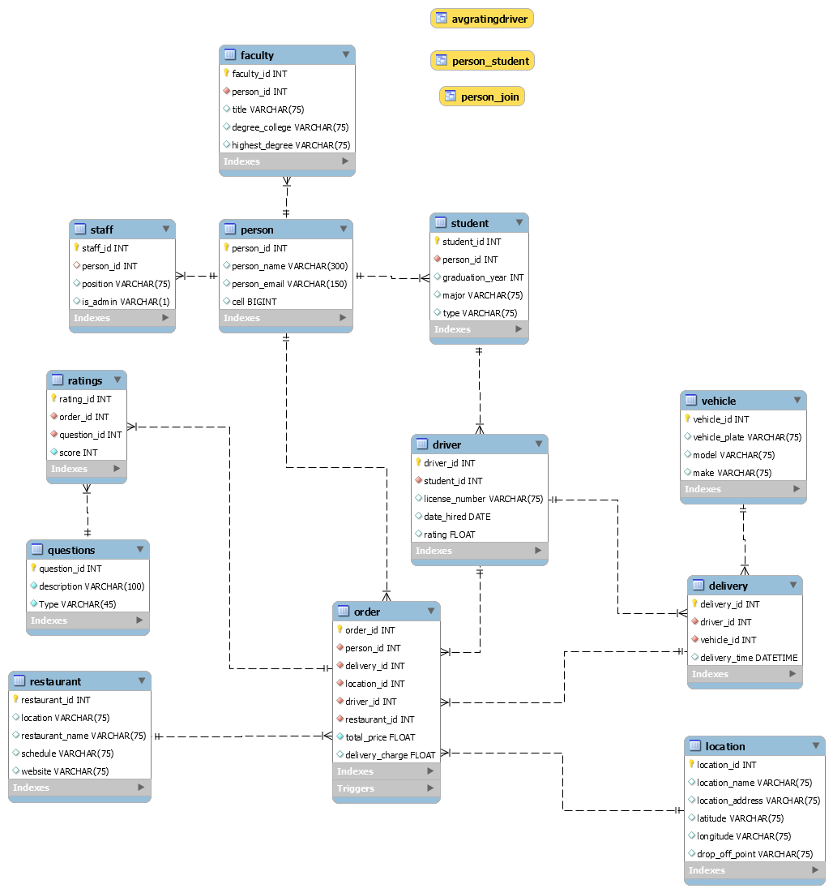

# Introduction

Group Members: Victoria Armour, Adam Brinegar, Morgan Carlton, Mia Fowler, Bryan Ketchie, Sawyer Strickland, and Anna Trent

Crave on Campus is an app that functions as an on-campus food delivery services who drivers are students of the university and whose customers are student, faculty and staff of the university. The app function acts similarly like GrubHub and DoorDash, however it’s campus controlled. Our team’s scope is to add a rating systems to the database, to control and track ratings of restaurants and delivery drivers. To start we will be using a database that is on loan from “Mavericks” from UNC Charlotte (Dhananjay Arora, AkshayBabu, Sumit Kawale and Prashant Madaan).  

## Index
* [Use Case for Rating Systems](#use-case-for-rating-systems)
* [Business Rules](#business-rules)
* [EERD](#eerd)
* [Data Dictionary](#data-dictionary)
* [MySQL Queries](#mysql-queries)
* [Stored Procedure](#stored-procedure)
* [Description of Future Work](#description-of-future-work)
* [MySQL Dump](#mysql-dump)
* [PowerPoint Video Link](#powerpoint-video-link)

## Use Case for Rating Systems

Students, Faculty and Staff can register as customers and log in to the Crave app and search for restaurants. They can order food and choose the time of delivery. The customers may be interested in the rating of restaurants when choosing where to place their order. The order is assigned to the driver. After the order is complete, the customer is prompted to insert a one rating per order, although it is not required. The Administrator can log in to view ratings of restaurant and drivers.  

## Business Rules

1. Persons (campus faculty, staff, students) have accounts in the system with PersonID (PK), Name, Email, Cell, etc.  For faculty we also keep Title, HighestDegree, and DegreeCollege.  For staff we keep Position and AdminYorN.  For students we keep GradYear and Major plus type (Undergraduate, Graduate).  Only faculty, staff and students are included.
2. We have Locations which are spots on campus where food can be delivered.  Some examples are dorms, the student center, and approved classroom buidings.  LocationID, LocationName, LocationAddress and (optional) Latitude and Longitude are maintained in the database. Additionally a food delivery drop-off point is included (designated place for meeting or delivering food in the location – this can be a brief description).
3. Persons can also be drivers (delivery personnel which have to be approved). Drivers have licenseNumber and DateHired plus Ratings. You may also want to keep vehicle information (relative to the vehicle that the driver uses).
    - UNCC will start with 8 approved delivery personnel – the system is in test mode.  You can assume all individuals have been cleared and they can be included in the database.  
    - All delivery personnel are students.
4. There is a flat fee of $5 for each delivery.  A person orders food one to many times.  An individual delivery is tied to one and only one person for the order.  The order is for one and only one restaurant.  For the items on the order we will only need to keep the total price and delivery charge, along with the driver and delivery times.  There should also be a unique identifier (ID) that ties to the id for the order at the indivudual restaurant.  You can assume that the actual items on the order need to come from the restaurant database.
5. Food providers or restaurants have to be approved in order to be included in the database.  You can include ten restaurants or more of your choice for the test database.  Information will include an ID, Location, Schedule, and a link to the web site along with other attributes you may identify.
6. You are adding a rating system which does not exist in the database.
7. The database will serve as an important data collection source providing valuable information about nutrition and eating habits of campus community members.

## EERD

## Data Dictionary

## MySQL Queries

## Stored Procedure

## Description of Future Work

## PowerPoint Video Link
  

  
  
  

  
  
